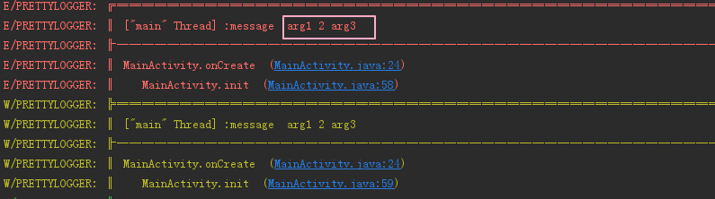
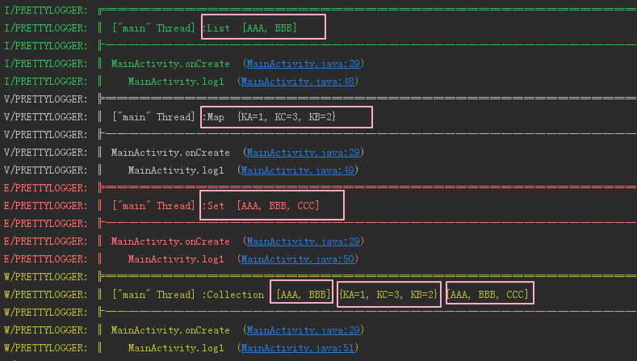
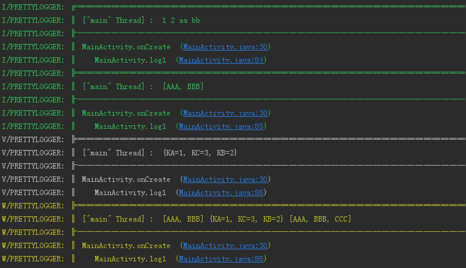
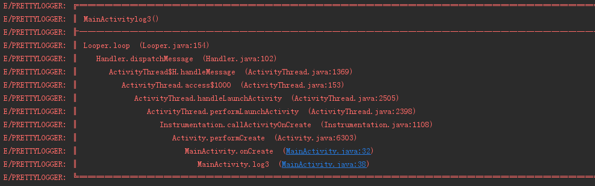
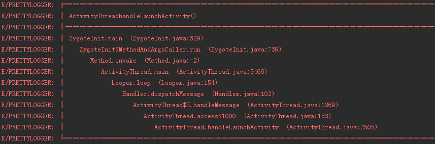
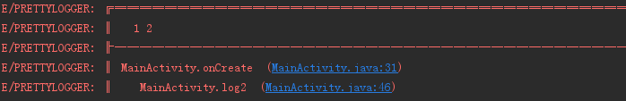
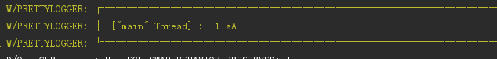
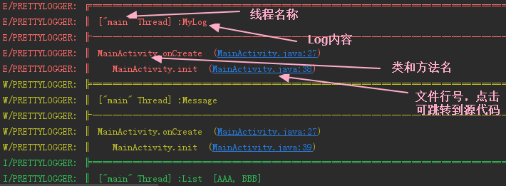
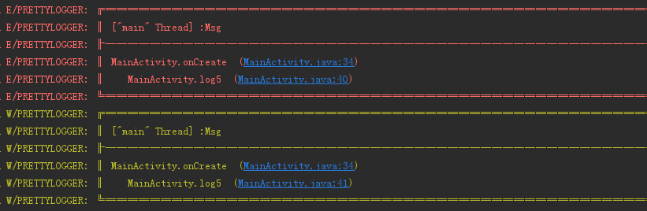

## [点击返回](https://github.com/Ayvytr/EasyAndroid)

# Logger
### Simple, pretty and powerful logger for android（简单，漂亮，强大的Android日志工具）

## 提供了：
	- 线程信息
	- 类信息
	- 方法名
	- Json字符串格式化打印
	- 遇到"\n"字符换行显示
	- 清除输出
	- 跳转到源代码
	- 你想要的各种输出效果

## 编译

### Step 1. Add the JitPack repository to your build file
#### Add it in your root build.gradle at the end of repositories:
	allprojects {
			repositories {
				...
				maven { url "https://jitpack.io" }
			}
		}
### Step 2. Add the dependency
	dependencies {
		        compile 'com.github.Ayvytr:logger:1.18'
		}


### Logger


#### 多参数使用

``` java
L.e("message", "arg1", 2, "arg3");
```


#### Array, Map, Set 和 List 输出
```java
L.i("Array", 1, 2, "aa", "bb");
L.i("List", list);
L.v("Map", map);
L.e("Set", set);
L.w("Collection", list, map, set);
```



#### 第一个参数什么类型都可以

```java
L.i(1, 2, "aa", "bb");
L.i(list);
L.v(map);
L.e(set);
L.w(list, map, set);
```
Log based
```java
L.t("mytag").d("hello");
```


#### 设置Tag

> ##### 随时更改
```java
L.t("MyTag").e(1);
```

> ##### 直接设置
```java
L.getSettings().tag("MyTag");
```

#### 更改输出的方法数量 (聪明的你是不是发现了什么？)
All logs
```java
L.getSettings().methodCount(10);
```
Log based
```java
L.t(1).d("hello");
```



#### 更改方法栈偏移(方法调用信息将会前移数量，和前边一张图片比较一下)
To integrate logger with other libraries, you can set the offset in order to avoid that library's methods.
```java
L.getSettings().methodOffset(10);
```



#### 隐藏线程信息
```java
L.getSettings().hideThreadInfo();
```



#### 不想显示方法调用信息
```java
L.getSettings().methodCount(0);
```



#### 打印Json
```java
L.json(YOUR_JSON_DATA);
```


#### 直接打印异常

```java
L.e(exception,"message");
```

### 设置（入口：L.getSettings())

```java
L
  .getSettings()                  // 获取Settings
  .tag(YOUR_TAG)                  // 默认tag： PRETTYLOGGER
  .methodCount(3)                 // 默认为 2
  .hideThreadInfo()               // 隐藏线程信息（默认显示）
  .logLevel(LogLevel.NONE)        // 默认 LogLevel.FULL
  .methodOffset(2)                // default 0
  .logAdapter(new AndroidLogAdapter()); //default AndroidLogAdapter
}

```
## 你的无(bian)理(tai)要求我都能满足

#### 默认的样子
```java
L.d("hello");
L.d("hello", "world", 5);   
```


```java
L.d("hello");
L.e("hello");
L.w("hello");
L.v("hello");
L.wtf("hello");
L.json(JSON_CONTENT);
L.xml(XML_CONTENT);
L.log(DEBUG, "tag", "message", throwable);
```

#### 我要每个日志都单独被框住
```java
L.getSettings().showBottomBorder(true);
```
```java
L.d("hello");
L.d("hello", "world", 5);   
```



#### 我要每条日志连起来（默认）


#### 我只想要我日志内容，不要框子
```java
L.getSettings().justShowMessage(true);
```
```java
L.d("hello");
L.d("hello", "world", 5);   
```


#### 我只想用，参数都不想填一个（我会帮你打印类和方法名）

```java
L.getSettings().justShowMessage(true);
```
```java
L.d();
L.w();   
```


#### 我要屏蔽日志（试试看能不能打印出来？）
```java
L.getSettings().logLevel(LogLevel.NONE);
```

### 替代我的LogAdapter
```java
class CustomLogAdapter Implement LogAdapter {}
settings.logAdapter(new CustomLogAdapter())
```

### Notes
- 使用日志筛选，格式更整齐


- 确认关掉日志换行选项


- Release使用LogLevel.NONE不输出任何日志